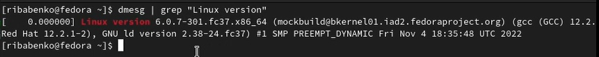
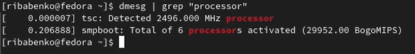
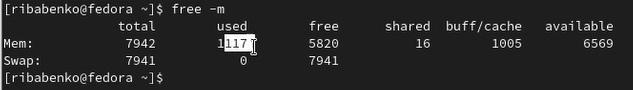
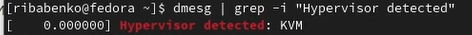
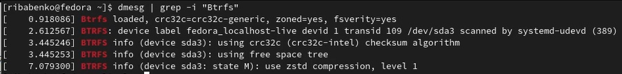
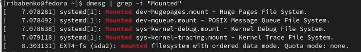

---
## Front matter
lang: ru-RU
title: Презентация по лабораторной работе №1
subtitle: Установка OC Linux
author:
  - Бабенко Р. И.
institute:
  - Российский университет дружбы народов, Москва, Россия
date: 19 феврфля 2023

## i18n babel
babel-lang: russian
babel-otherlangs: english

## Formatting pdf
toc: false
toc-title: Содержание
slide_level: 2
aspectratio: 169
section-titles: true
theme: metropolis
header-includes:
 - \metroset{progressbar=frametitle,sectionpage=progressbar,numbering=fraction}
 - '\makeatletter'
 - '\beamer@ignorenonframefalse'
 - '\makeatother'
---

## Докладчик

:::::::::::::: {.columns align=center}
::: {.column width="70%"}

  * Бабенко Роман Игоревич
  * студент
  * направление "Математика и механика"
  * Российский университет дружбы народов
  * <https://github.com/skrabik>

:::
::: {.column width="30%"}

:::
::::::::::::::

# Вводная часть

## Цели и задачи

Целью данной работы является приобретение практических навыков установки операционной системы на виртуальную машину, настройки минимально необходимых для дальнейшей работы сервисов.

## Выполнение работы 

Виртуальна машина была установлена и настроена в первом семестре, поэтому сразу перехожу к выполнению "Домашнего задания"

## Выполнение работы 

Для того, чтобы найти версию ядра, вводим: (рис. @fig:001).

{#fig:001 width=70%}

## Выполнение работы 

Для того, чтобы найти частоту процессора, вводим: (рис. @fig:002).

{#fig:002 width=70%}

## Выполнение работы 

Для того, чтобы найти модель процессора, вводим: (рис. @fig:003).

{#fig:003 width=70%}

## Выполнение работы 

Для того, чтобы найти объём доступной оперативной памяти, вводим: (рис. @fig:004).

{#fig:004 width=70%}

## Выполнение работы 

Для того, чтобы найти тип гипервизора, вводим: (рис. @fig:005).

{#fig:005 width=70%}

## Выполнение работы 

Для того, чтобы найти тип файловой системы, вводим: (рис. @fig:006).

{#fig:006 width=70%}

## Выполнение работы 

Для того, чтобы найти тип последовательность монтирования файловых систем, вводим: (рис. @fig:007).

{#fig:007 width=70%}

## Итоговый слайд

В ходе выполнения лабораторной работы я освежил в памяти, как нужно устанавливать операционную систему на виртуальную машину и настраивать необходимые сервисы

:::

