---
## Front matter
title: "Отчёт по лабораторной работе №2"
subtitle: "Первоначальна настройка git"
author: "Бабенко Роман Игоревич"

## Generic otions
lang: ru-RU
toc-title: "Содержание"

## Bibliography
bibliography: bib/cite.bib
csl: pandoc/csl/gost-r-7-0-5-2008-numeric.csl

## Pdf output format
toc: true # Table of contents
toc-depth: 2
lof: true # List of figures
lot: true # List of tables
fontsize: 12pt
linestretch: 1.5
papersize: a4
documentclass: scrreprt
## I18n polyglossia
polyglossia-lang:
  name: russian
  options:
	- spelling=modern
	- babelshorthands=true
polyglossia-otherlangs:
  name: english
## I18n babel
babel-lang: russian
babel-otherlangs: english
## Fonts
mainfont: PT Serif
romanfont: PT Serif
sansfont: PT Sans
monofont: PT Mono
mainfontoptions: Ligatures=TeX
romanfontoptions: Ligatures=TeX
sansfontoptions: Ligatures=TeX,Scale=MatchLowercase
monofontoptions: Scale=MatchLowercase,Scale=0.9
## Biblatex
biblatex: true
biblio-style: "gost-numeric"
biblatexoptions:
  - parentracker=true
  - backend=biber
  - hyperref=auto
  - language=auto
  - autolang=other*
  - citestyle=gost-numeric
## Pandoc-crossref LaTeX customization
figureTitle: "Рис."
tableTitle: "Таблица"
listingTitle: "Листинг"
lofTitle: "Список иллюстраций"
lotTitle: "Список таблиц"
lolTitle: "Листинги"
## Misc options
indent: true
header-includes:
  - \usepackage{indentfirst}
  - \usepackage{float} # keep figures where there are in the text
  - \floatplacement{figure}{H} # keep figures where there are in the text
---

# Цель работы

Изучить идеологию и применение средств контроля версий и освоить мения работы с git.

# Выполнение лабораторной работы

Установим Git (рис. @fig:001).

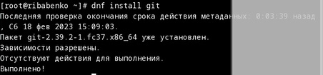{#fig:001 width=70%}

Установим gh (рис. @fig:002)

{#fig:002 width=70%}

Зададим имя и email владельца репозитория(рис. @fig:003).

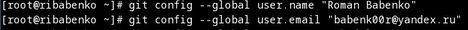{#fig:003 width=70%}

Настраиваем utf-8 (рис. @fig:004).

{#fig:004 width=70%}

Настраиваем верификацию и  подписание коммитов git и других параметров (рис. @fig:005).

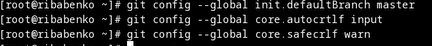{#fig:005 width=70%}

Создаём ключи по алгоритмам (рис. @fig:006).

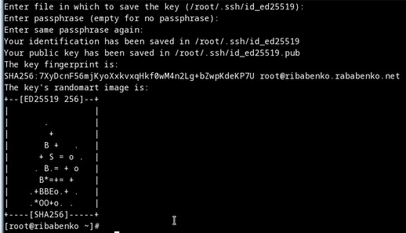{#fig:006 width=70%}

Создаём ключи pgp(рис. @fig:007).

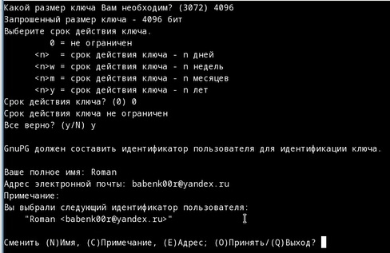{#fig:007 width=70%}

Выводим список ключей и копируем отпечаток приватного ключа(рис. @fig:008).

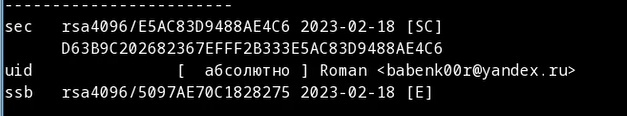{#fig:008 width=70%}

Скопируем сгенерированный pgp ключ в буфер обмена(рис. @fig:009).

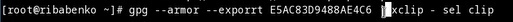{#fig:009 width=70%}
 
Добавляем ключ на github (рис. @fig:010).

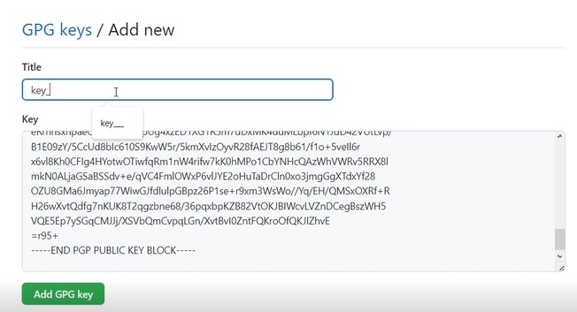{#fig:010 width=70%}

Используя приведённый email указываем git применять его при подписи коммитов (рис. @fig:011).

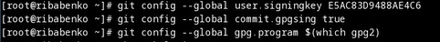{#fig:011 width=70%}

Авторизируемся на github через командную строку Linux (рис. @fig:012).

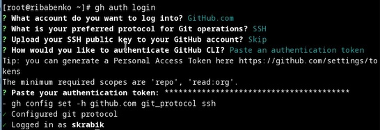{#fig:012 width=70%} 

Создадим репозиторий курса  на основе шаблолна (рис. @fig:013).

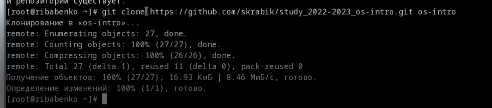{#fig:013 width=70%} 

Удаляем лишние файлы (рис. @fig:014).

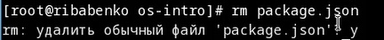{#fig:014 width=70%} 

Создайм необходимые каталоги (рис. @fig:015).

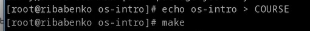{#fig:015 width=70%} 
 
Оптправляем файлы на сервер(рис. @fig:016).

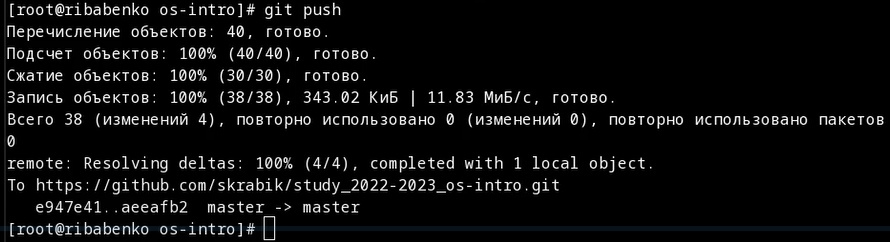{#fig:016 width=70%} 

# Выводы

В ходе выполнения данной лабораторной работы я изучил идеологию и применение средств контроля версий и освоил умения работы с git.
