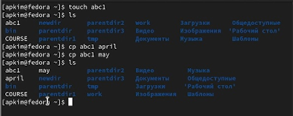
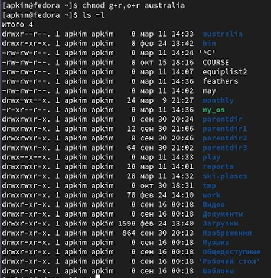
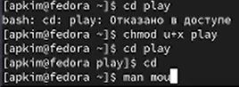
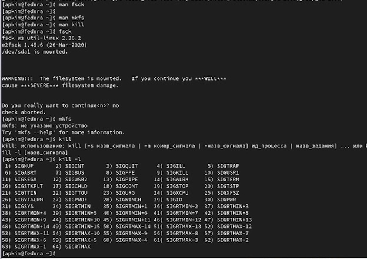

---
## Front matter
lang: ru-RU
title: Отчет по лабораторной работе №5
subtitle: Анализ файловой системы Linux. Команды для работы с файлами и каталогами
author:
  - Бабенко Р.И.
institute:
  - Российский университет дружбы народов, Москва, Россия
date: 11 марта 2023 год

## i18n babel
babel-lang: russian
babel-otherlangs: english

## Formatting pdf
toc: false
toc-title: Содержание
slide_level: 2
aspectratio: 169
section-titles: true
theme: metropolis
header-includes:
 - \metroset{progressbar=frametitle,sectionpage=progressbar,numbering=fraction}
 - '\makeatletter'
 - '\beamer@ignorenonframefalse'
 - '\makeatother'
---

# Информация

## Докладчик

:::::::::::::: {.columns align=center}
::: {.column width="70%"}

  * Бабеноко Роман Игоревич 
  * студент
  * направление "Математика и механика"
  * Российский университет дружбы народов

:::
::: {.column width="30%"}

:::
::::::::::::::

# Вводная часть

## Цели и задачи

Ознакомление с файловой системой Linux, ее структурой, именами и содержанием каталогов. Приобретение практических навыков по применению команд для работы с файлами и каталогами, по управлению процессами (и работами), по проверке использования диска и обслуживанию файловой системы.

## Выполнение работы 

Выполняем первое задание, проходимся по примерам из теоретического этапа лабораторной работы. Например, делаем копирование файла в текущем каталоге (рис.1)

## Выполнение работы 

Далее, например, переименовываем файлы в текущем каталоге (рис.2)

## Выполнение работы 

Также можем сделать перемещение каталога в другой каталог (рис.3)

## Выполнение работы 

Далее создаем файл с правом выполнения для владельца, а затем лишаем владельца файла права на выполнение (рис.4)

## Выполнение работы 

Выполняем второе задание. Для начала скопируем нужный файл в домашний каталог и назовем его equipment (рис.5)

## Выполнение работы 

Работаем с файлами (рис.6)

## Выполнение работы 

Определяем опции команды chmod (рис.7)

## Выполнение работы 

Просматриваем содержимое файла /etc/passwd (рис.8)

## Выполнение работы 

Работаем с правами файла (рис.9)

## Выполнение работы 

Просматриваем команду man (рис.10)

## Вывод

В ходе данной лабораторной работы мы ознакомились с файловой системой Linux.

:::

