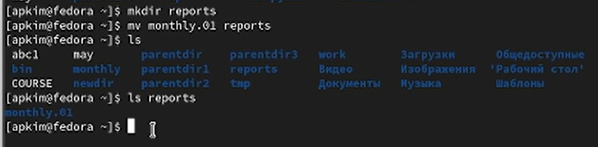
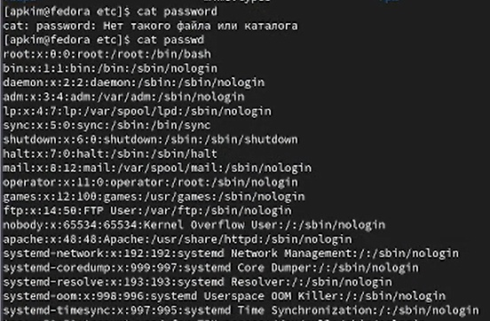
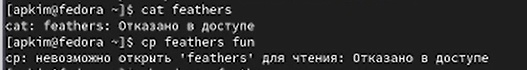

---
## Front matter
title: "Отчет по лабораторной работе №5"
subtitle: "Дисциплина: Компьютерные науки и технологии программирования"
author: "Бабенко Роман Игоревич"

## Generic otions
lang: ru-RU
toc-title: "Содержание"

## Bibliography
bibliography: bib/cite.bib
csl: pandoc/csl/gost-r-7-0-5-2008-numeric.csl

## Pdf output format
toc: true # Table of contents
toc-depth: 2
lof: true # List of figures
lot: true # List of tables
fontsize: 12pt
linestretch: 1.5
papersize: a4
documentclass: scrreprt
## I18n polyglossia
polyglossia-lang:
  name: russian
  options:
	- spelling=modern
	- babelshorthands=true
polyglossia-otherlangs:
  name: english
## I18n babel
babel-lang: russian
babel-otherlangs: english
## Fonts
mainfont: PT Serif
romanfont: PT Serif
sansfont: PT Sans
monofont: PT Mono
mainfontoptions: Ligatures=TeX
romanfontoptions: Ligatures=TeX
sansfontoptions: Ligatures=TeX,Scale=MatchLowercase
monofontoptions: Scale=MatchLowercase,Scale=0.9
## Biblatex
biblatex: true
biblio-style: "gost-numeric"
biblatexoptions:
  - parentracker=true
  - backend=biber
  - hyperref=auto
  - language=auto
  - autolang=other*
  - citestyle=gost-numeric
## Pandoc-crossref LaTeX customization
figureTitle: "Рис."
tableTitle: "Таблица"
listingTitle: "Листинг"
lofTitle: "Список иллюстраций"
lotTitle: "Список таблиц"
lolTitle: "Листинги"
## Misc options
indent: true
header-includes:
  - \usepackage{indentfirst}
  - \usepackage{float} # keep figures where there are in the text
  - \floatplacement{figure}{H} # keep figures where there are in the text
---

# Цель работы

Ознакомление с файловой системой Linux, ее структурой, именами и содержанием каталогов. Приобретение практических навыков по применению команд для работы с файлами и каталогами, по управлению процессами (и работами), по проверке использования диска и обслуживанию файловой системы.

# Выполнение лабораторной работы

Сначала мы делаем копирование файла в текущем каталоге. Нам нужно скопировать файл ~/abc1 в файл april и в файл may (рис. @fig:001).

{#fig:001 width=70%}

Далее выполняем копирование нескольких файлов в каталог (рис. @fig:002).

{#fig:002 width=70%}

Копирование файлов в произвольном каталоге (рис. @fig:003).

{#fig:003 width=70%}

Далее выполняем копирование файлов в текущем каталоге (рис. @fig:004).

{#fig:004 width=70%}

Теперь нам нужно переименовать файлы в текущем каталоге (рис. @fig:005).

{#fig:005 width=70%}

Далее перемещаем файлы в другой каталог (рис. @fig:006).

{#fig:006 width=70%}

Теперь переименовываем каталоги в текущем каталоге (рис. @fig:007).

{#fig:007 width=70%}

Теперь перемещаем каталог в другой каталог и переименовываем его (рис. @fig:008).

{#fig:008 width=70%}

Создаем файл ~/may с правом выполнения для владельца, затем лишаем владельца файла права на выполнение (рис. @fig:009).

{#fig:009 width=70%}

Далее создаем каталог monthly с запретом на чтение для членов группы и всех остальных пользователей (рис. @fig:0010).

{#fig:0010 width=70%}

Теперь требуется создать файл с правом записи для членов группы (рис. @fig:0011).

{#fig:0011 width=70%}

Скопируем файл в домашний каталог и назовем его equipment (рис. @fig:0012).

{#fig:0012 width=70%}

Перемещаем файл equipment в каталог ~/ski.plases (рис. @fig:0013).

{#fig:0013 width=70%}

Переименуем файл ~/ski.plases/equipment в ~/ski.plases/equiplist (рис. @fig:0014).

{#fig:0014 width=70%}

Создаем в домашнем каталоге файл abc1 и скопируем его в каталог ~/ski.plases, назовем его equiplist2 (рис. @fig:0015).

{#fig:0015 width=70%}

Создаем каталог с именем equiopment в каталоге ~/ski.plases (рис. @fig:0016).

{#fig:0016 width=70%}

Создаем и перемещаем каталог ~/newdir в каталог ~/ski.plases (рис. @fig:0017).

{#fig:0017 width=70%}

Определение опции команды chmod, необходимые для того, чтобы присовить перечисленным ниже файлам выделенные права доступа, считая, что в начале таких прав нет (рис. @fig:0018).

{#fig:0018 width=70%}

Продолжение создания файлов (рис. @fig:0019).

{#fig:0019 width=70%}

Определение опции команды chmod (1) (рис. @fig:0020).

{#fig:0020 width=70%}

Определение опции команды chmod (2) (рис. @fig:0021).

{#fig:0021 width=70%}

Далее просматриваем содержимое файла /etc/passwd (рис. @fig:0022).

{#fig:0022 width=70%}

Теперь скопируем файл ~/feathers в файл ~/file.old, затем переместим файл ~/file.old в файл ~/play, затем скопируем каталог ~/play в каталог ~/fun, переместим каталог ~/fun в каталог ~/play и назовем его games (рис. @fig:0023).

{#fig:0023 width=70%}

Лишаем владельца файла права на чтение (рис. @fig:0024).

{#fig:0024 width=70%}

Проверяем, что произойдет, если мы попытаемся просмотреть файл командой cat, и если мы попытаемся скопировать файл (рис. @fig:0025).

{#fig:0025 width=70%}

Даем владельцу файла право на чтение (рис. @fig:0026).

{#fig:0026 width=70%}

Переходим в каталог ~/play (рис. @fig:0027).

{#fig:0027 width=70%}

Прочитываем man по команде mount (рис. @fig:0028).

{#fig:0028 width=70%}

Прочитываем man по команде fsck, mkfs, kill (рис. @fig:0029).

{#fig:0029 width=70%}

# Выводы

В ходе выполнения работы мы ознакомились с файловой системой Linux.

# Список литературы{.unnumbered}

::: {#refs}
:::
